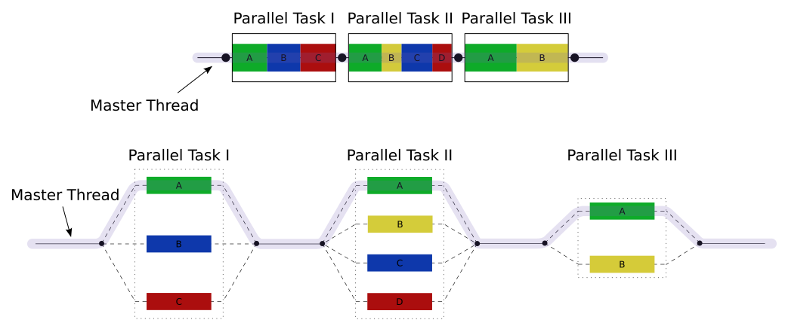

Cython Intro: get the benefits of C without leaving Python.
###########################################################

.. Create a pdf of these slides with the command: rst2pdf -e inkscape -b1 -s slides.style slides.rst
.. Create an S5 html slide output with the command: rst2s5 slides.rst -d slides.html
.. TODO: get a nice image for the cover page, some svg for all backgrounds

Myself
------

* Background in Earth Sciences, Geophysics
* Using Python since 2001
* Software developer for GNS Science

.. TODO: background on Claritas.  Me: OBSs and seismics in Canada before coming to NZ to work on Claritas.

What is Cython
--------------

.. TODO: history of Cython, esp Greg Ewing from Uni of Canterbury!

* Fork of Pyrex
* Easy Python C extensions
* Performance boost
* Python -> C bridge
* C->Cython bridge (embedding)

Python Demo
-----------

.. todo: replace with dire warnings about how complex the C api is compared to Python

from https://docs.python.org/2/c-api/intro.html:

.. code-block:: python

    def incr_item(dict, key):
        try:
            item = dict[key]
        except KeyError:
            item = 0
        dict[key] = item + 1

Python C-API Demo
-----------------

.. code-block:: c
    
    int 
    incr_item(PyObject *dict, PyObject *key)
    {
        /* Objects all initialized to NULL for Py_XDECREF */
        PyObject *item = NULL,
        *const_one = NULL,
        *incremented_item = NULL;
        /* Return value initialized to -1 (failure) */
        int rv = -1;

        item = PyObject_GetItem(dict, key);
        if (item == NULL) {
            /* Handle KeyError only: */
            if (!PyErr_ExceptionMatches(PyExc_KeyError))
                goto error;

            /* Clear the error and use zero: */
            PyErr_Clear();
            item = PyInt_FromLong(0L);
            if (item == NULL)
                goto error;
        }
        const_one = PyInt_FromLong(1L);
        if (const_one == NULL)
            goto error;

        incremented_item = PyNumber_Add(item, const_one);
        if (incremented_item == NULL)
            goto error;

        if (PyObject_SetItem(dict, key, incremented_item) < 0)
            goto error;
        rv = 0; /* Success */
        /* Continue with cleanup code */

    error:
        /* Cleanup code, shared by success and failure path */

        /* Use Py_XDECREF() to ignore NULL references */
        Py_XDECREF(item);
        Py_XDECREF(const_one);
        Py_XDECREF(incremented_item);

        return rv; /* -1 for error, 0 for success */
    }

Cython Advantages
-----------------

* 99% Python
* Python 2/3 compatibility
* Classes
* Garbage collection
* Easy string handling
* Automatic reference counting
* Automatic type casting (Python->C)
* Compliant C code
* Stable, mature

.. TODO: a cython workflow diagram.  Cython-> C -> C extension

Python demo counter
-------------------

.. code-block:: python

    def counter(count):
        x = 0
        for i in range(count):
            x += i

Cython demo counter
-------------------

.. code-block:: cython

    def counter(count):
        cdef int x = 0 # <- a C style data type
        for i in range(count):
            x += i

Cython cdef-ed demo counter
---------------------------

.. code-block:: cython

    cdef int counter(int count):
        cdef int x = 0
        for i in range(count):
            x += i
        return x

.. TODO: cdeff-ed functions, cdeffed input args, numpy arrays (ok, later)

Cython and the GIL
------------------

.. image:: ./long_line.jpg
    :width: 55%

.. info. GIL causes every Python call to run a single thread at a time.  ie: no threads in parallel

Bypassing the GIL with C
------------------------

Modules that release the GIL:

* time.sleep()
* numpy
* most C extensions

.. These will run in parallel when using threading module

Cython nogil
------------

.. code-block:: cython

    def cython_func():
        with nogil:
            do_something()

            if something_bad == True:
                with gil:
                    raise RuntimeError('sorry...')

Threading headaches:
--------------------

* race conditions
* data corruption
* yikes!  Wait...

Easier multithreading from C?!
------------------------------

OpenMP: Shared memory multithreading C API/spec

source: https://en.wikipedia.org/wiki/OpenMP

Classic Demo Updated
--------------------

* 2D Laplace Equation benchmark by Prabhu Ramachandran in 2004:
    http://wiki.scipy.org/PerformancePython
* Updated in by Travis Oliphant in 2011:
    http://technicaldiscovery.blogspot.co.nz/2011/06/speeding-up-python-numpy-cython-and.html

.. TODO: an image demonstrating what it's doing, maybe the equation itself (use math:)

.. TODO: introduce *all* implementations, especially cython parallel and numba

Python version
--------------

* Simple loop based approach
* Modifies array in-place

.. code-block:: python

    def py_update(u, dx2, dy2):
        nx, ny = u.shape
        for i in xrange(1,nx-1):
            for j in xrange(1, ny-1):
                u[i,j] = ((u[i+1, j] + u[i-1, j]) * dy2 +
                        (u[i, j+1] + u[i, j-1]) * dx2) / (2*(dx2+dy2))

.. note: mention that previous computations introduce artifacts but discussed by Prahbu, approach zero

Numpy version
-------------

* Eliminates all loops
* Extensive use of NumPy vectorized operations
* Creates several temporary arrays 

.. code-block:: python

    import numpy as np

    def num_update(u, dx2, dy2):
        u[1:-1,1:-1] = ((u[2:,1:-1] + u[:-2,1:-1])*dy2 +
                        (u[1:-1,2:] + u[1:-1,:-2])*dx2) / (2*(dx2+dy2))

Cython version
--------------

* Nearly identical to the Python version
* Cython datatypes

.. code-block:: cython

    import numpy as np
    cimport numpy as np
    cimport cython

    def cy_update(np.ndarray[double, ndim=2] u, double dx2, double dy2):
        cdef int i, j
        for i in xrange(1,u.shape[0]-1):
            for j in xrange(1, u.shape[1]-1):
                u[i,j] = ((u[i+1, j] + u[i-1, j]) * dy2 +
                          (u[i, j+1] + u[i, j-1]) * dx2) / (2*(dx2+dy2))

Cython version: setup.py
------------------------

.. TODO: see if we can make this even simpler:

.. code-block:: python

    from distutils.core import setup
    from distutils.extension import Extension
    from Cython.Build import cythonize

    extensions = [Extension('cy_laplace', ['cy_laplace.pyx'])]

    setup(name = 'Demos', ext_modules = cythonize(extensions))

Cython C wrapper
----------------

Calls a C Laplace implementation

.. code-block:: cython

    import numpy as np
    cimport numpy as np

    cdef extern from "claplace.h":
        void c_update(double *u, int x_len, int y_len, double dx2, double dy2)

    def cy_update_c_wrap(np.ndarray[double, ndim=2] u, dx2, dy2):
        """Wrap a C function that performs the 2D Laplace equation in-place"""

        c_update(<double *> &u[0,0], u.shape[0], u.shape[1], dx2, dy2)

Cython C wrapper: setup.py
--------------------------

.. code-block:: python

    from distutils.core import setup
    from distutils.extension import Extension
    from Cython.Build import cythonize

    extensions = [Extension('cy_wrap_claplace',
                            ['cy_wrap_claplace.pyx', 'claplace.c'],
                            extra_compile_args=['-fopenmp'],
                            extra_link_args=['-fopenmp']
                            )
                 ]

    setup(name = 'Demos', ext_modules = cythonize(extensions))

Cython parallel version
-----------------------

.. code-block:: cython

    # imports omitted

    @cython.boundscheck(False)
    @cython.wraparound(False)
    def cy_update_parallel(np.ndarray[double, ndim=2] u, 
                           double dx2,
                           double dy2):
        cdef int i, j
        for i in prange(1, u.shape[0]-1, nogil=True):
            for j in xrange(1, u.shape[1]-1):
                u[i,j] = ((u[i+1, j] + u[i-1, j]) * dy2 +
                          (u[i, j+1] + u[i, j-1]) * dx2) / (2*(dx2+dy2))

Numba version
-------------

Identical to Python version apart from jit decorator

.. code-block:: python

    from numba import jit

    @jit
    def numba_update(u, dx2, dy2):
        for i in xrange(1,u.shape[0]-1):
            for j in xrange(1, u.shape[1]-1):
                u[i,j] = ((u[i+1, j] + u[i-1, j]) * dy2 +
                          (u[i, j+1] + u[i, j-1]) * dx2) / (2*(dx2+dy2))

Conclusions
-----------

.. TODO: add benchmark images after each implementation above

All code available on Github: https://github.com/crleblanc/cython_talk_2105

Questions?
----------

.. TODO: show the PyQt demo, one with the GIL released, the other with it locked

.. footer::

    Get the benefits of C without leaving Python