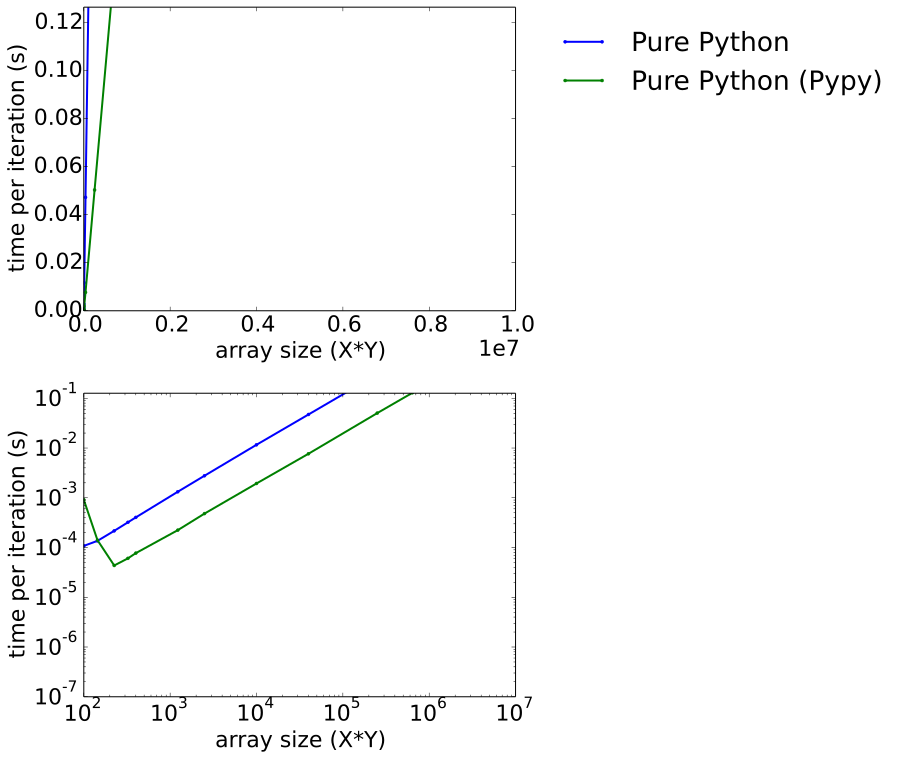
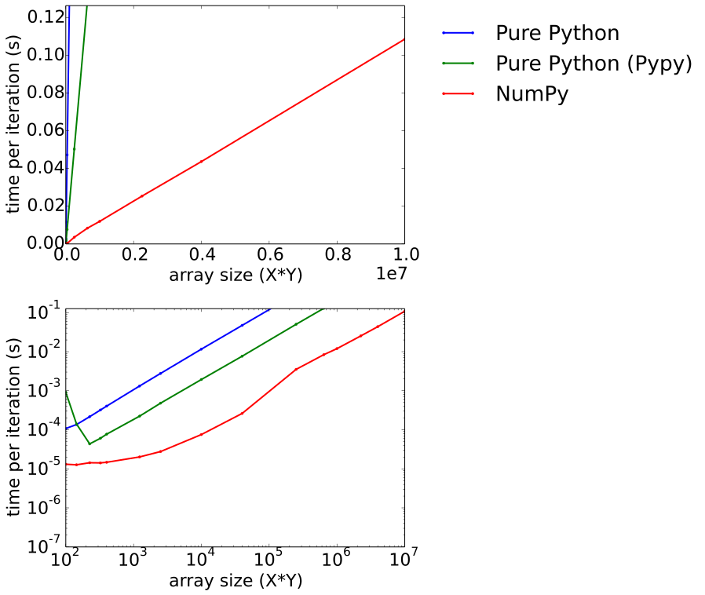
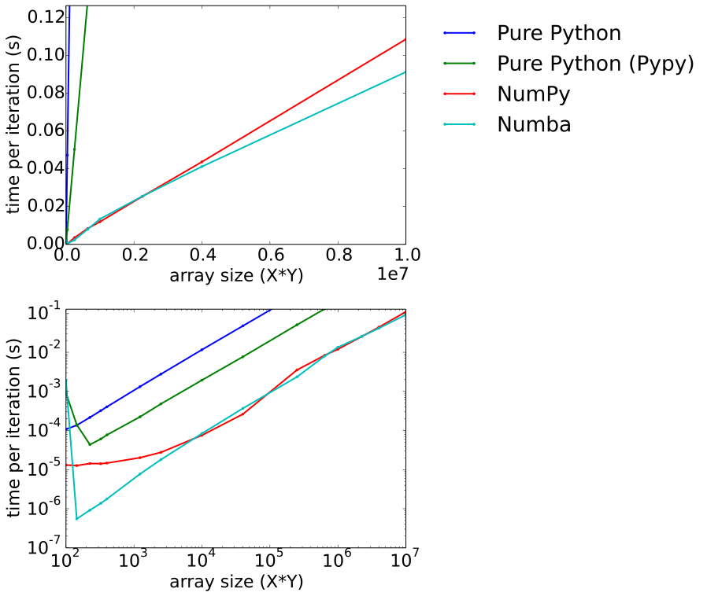
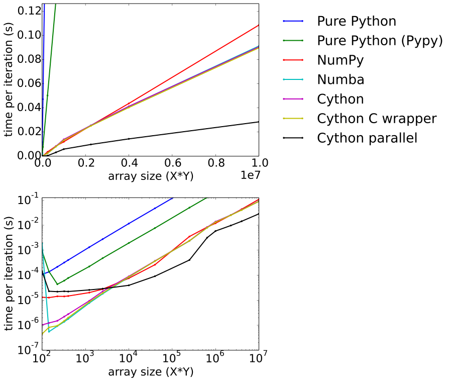

.. Create a pdf of these slides with the command: rst2pdf -e inkscape -b1 -s slides.style slides.rst
.. Create an S5 html slide output with the command: rst2s5 slides.rst -d slides.html

.. image:: slide_cover.svg
    :width: 85%

Myself
------

* Background in Earth Sciences, Geophysics
* Using Python since 2001
* Software developer for GLOBE Claritas, GNS Science

.. Me: OBSs and seismics in Canada before coming to NZ to work on Claritas.

What is Cython
--------------

.. TODO: history of Cython, esp Greg Ewing from Uni of Canterbury!

* Fork of Pyrex
* Easy Python C extensions
* Performance boost
* Python -> C bridge
* C -> Cython bridge

Python Demo
-----------

from https://docs.python.org/2/c-api/intro.html:

.. code-block:: python

    def incr_item(dict, key):
      try:
        item = dict[key]
      except KeyError:
        item = 0

      dict[key] = item + 1

Python C-API Demo
-----------------

.. code-block:: c
    
    int 
    incr_item(PyObject *dict, PyObject *key)
    {
        /* Objects all initialized to NULL for Py_XDECREF */
        PyObject *item = NULL,
        *const_one = NULL,
        *incremented_item = NULL;
        /* Return value initialized to -1 (failure) */
        int rv = -1;

        item = PyObject_GetItem(dict, key);
        if (item == NULL) {
            /* Handle KeyError only: */
            if (!PyErr_ExceptionMatches(PyExc_KeyError))
                goto error;

.. code-block:: c

            /* Clear the error and use zero: */
            PyErr_Clear();
            item = PyInt_FromLong(0L);
            if (item == NULL)
                goto error;
        }

        const_one = PyInt_FromLong(1L);
        if (const_one == NULL)
            goto error;

        incremented_item = PyNumber_Add(item, const_one);
        if (incremented_item == NULL)
            goto error;

        if (PyObject_SetItem(dict, key, incremented_item) < 0)
            goto error;
        rv = 0; /* Success */
        /* Continue with cleanup code */

.. code-block:: c

    error:
        /* Cleanup code, shared by success and failure path */

        /* Use Py_XDECREF() to ignore NULL references */
        Py_XDECREF(item);
        Py_XDECREF(const_one);
        Py_XDECREF(incremented_item);

        return rv; /* -1 for error, 0 for success */
    }

Cython Advantages
-----------------

.. ? Maybe avoid all these bullet points, just mention them...  Maybe table of Advantages/disadvantages

* 99% Python
* Python 2/3 compatibility
* Classes
* Garbage collection
* String handling
* Automatic reference counting
* Automatic type casting (Python->C, C->Python)
* Portable C code produced
* Stable, mature

Cython Disadvantages
--------------------

* Needs compilation
* Distutils
* CPython specific

Python demo counter
-------------------

.. code-block:: python

    def counter(count):
      x = 0
      for i in xrange(count):  # range in Py3
        x += i

Cython demo counter
-------------------

.. code-block:: cython

    def counter(count):
      cdef int x = 0 # <- a C style data type
      for i in xrange(count):
        x += i

Cython cdef-ed demo counter
---------------------------

.. code-block:: cython

    cdef int counter(int count):
      cdef int x = 0
      for i in xrange(count):
        x += i
      return x

Building a Cython module
------------------------

* Cython translates from .pyx to C code
    cython inputfile.pyx
* Or let setup.py handle it
    python setup.py build_ext --inplace

Cython and the GIL
------------------

.. info. GIL causes every Python call to run a single thread at a time.  ie: no threads in parallel

Bypassing the GIL with C
------------------------

Modules that release the GIL:

* time.sleep()
* most of NumPy
* many C extensions

.. These will run in parallel when using threading module

Cython nogil
------------

.. code-block:: cython

    def cython_func():
      with nogil:
        do_something()

        if something_bad == True:
          with gil:
            raise RuntimeError('sorry...')

Threading headaches:
--------------------

* race conditions
* deadlocks
* data corruption
* thread pools
* Yikes!  Wait...

Easier multithreading... from C?!
---------------------------------

OpenMP: Shared memory multithreading C API/spec

source: https://en.wikipedia.org/wiki/OpenMP

Classic Demo Updated
--------------------

* 2D Laplace Equation benchmark by Prabhu Ramachandran in 2004:
    http://wiki.scipy.org/PerformancePython
* Updated in by Travis Oliphant in 2011:
    http://technicaldiscovery.blogspot.co.nz/2011/06/speeding-up-python-numpy-cython-and.html
* Previously compared:
    Psyco, NumPy, Blitz, Inline, Python/Fortran, Pyrex, MatLab, Octave, Pure C++
* We'll disucss:
    Python, Pypy, NumPy, Numba, Cython, Cython wrapping C, Cython in parallel

2D Laplace equation
-------------------

* floating point intensive
* iterative

Starting state
--------------

10 iterations
-------------

100 iterations
--------------

1000 iterations
---------------

10000 iterations
----------------

.. image:: output_array_4.png
    :width: 60%

Python version
--------------

.. code-block:: python

    def py_update(u, dx2, dy2):
      nx, ny = u.shape
      for i in xrange(1,nx-1):
        for j in xrange(1, ny-1):
          u[i,j] = ((u[i+1, j] + u[i-1, j]) * dy2 +
                    (u[i, j+1] + u[i, j-1]) * dx2) / (2*(dx2+dy2))

    work_array = np.zeros([array_shape, array_shape],
                          dtype=np.float64)
    work_array[0] = 1.0

    for x in range(100):
      py_update(work_array, dx2, dy2)

.. note: mention that previous computations introduce artifacts but discussed by Prahbu, approach zero

Python benchmark
----------------

PyPy benchmark
----------------

Numpy version
-------------

* Eliminates all loops
* Extensive use of NumPy vectorized operations
* Creates several temporary arrays 

.. code-block:: python

    import numpy as np

    def num_update(u, dx2, dy2):
      u[1:-1,1:-1] = ((u[2:,1:-1] + u[:-2,1:-1])*dy2 +
                      (u[1:-1,2:] + u[1:-1,:-2])*dx2)/(2*(dx2+dy2))

Numpy Benchmark
---------------

Numba version
-------------

* Identical to Python version apart from jit decorator

.. code-block:: python

    from numba import jit

    @jit
    def numba_update(u, dx2, dy2):
      for i in xrange(1,u.shape[0]-1):
        for j in xrange(1, u.shape[1]-1):
          u[i,j] = ((u[i+1, j] + u[i-1, j]) * dy2 +
                    (u[i, j+1] + u[i, j-1]) * dx2) / (2*(dx2+dy2))

Numba benchmark
---------------

Cython version
--------------

* Similar to the Python and Numba versions

.. code-block:: cython

    import numpy as np
    cimport numpy as np
    cimport cython

    @cython.boundscheck(False)
    @cython.wraparound(False)
    def cy_update(np.ndarray[double, ndim=2] u, 
                  double dx2,
                  double dy2):
      cdef int i, j
      for i in xrange(1,u.shape[0]-1):
        for j in xrange(1, u.shape[1]-1):
          u[i,j] = ((u[i+1, j] + u[i-1, j]) * dy2 +
                    (u[i, j+1] + u[i, j-1]) * dx2) / (2*(dx2+dy2))

Cython version: setup.py
------------------------

.. code-block:: python

    from distutils.core import setup
    from distutils.extension import Extension
    from Cython.Build import cythonize

    extensions = [Extension('cy_laplace', ['cy_laplace.pyx'])]

    setup(name = 'Demos', ext_modules = cythonize(extensions))

Build module with a single command:
    python setup.py build_ext --inplace

Cython benchmark
----------------

Cython C wrapper
----------------

* Calls a C Laplace implementation.  Similar to Ctypes or CFFI.

.. code-block:: cython

    import numpy as np
    cimport numpy as np

    cdef extern from "claplace.h":
      void c_update(double *u, int x_len, int y_len,
                    double dx2, double dy2)

    def cy_update_c_wrap(np.ndarray[double, ndim=2] u, dx2, dy2):
      c_update(<double *> &u[0,0], u.shape[0], u.shape[1], dx2, dy2)

C implementation
----------------

C code in a Python talk?!

.. code-block:: c

    void c_update(double *u,
                  int nx,
                  int ny,
                  double dx2,
                  double dy2) {
      int i, j, idx;
      for (i=1; i<ny-1; i++) {
        for (j=1; j<nx-1; j++) {
          idx = i*nx + j;
          u[idx] = ((u[idx+nx] + u[idx-nx]) * dy2 +
                    (u[idx+1] + u[idx-1]) * dx2) / (2*(dx2+dy2));
            }
        }
    }

Cython C wrapper: setup.py
--------------------------

.. code-block:: python

    from distutils.core import setup
    from distutils.extension import Extension
    from Cython.Build import cythonize

    extensions = [Extension('cy_wrap_claplace',
                            ['cy_wrap_claplace.pyx',
                             'claplace.c'],
                            #extra_compile_args=['-fopenmp'],
                            #extra_link_args=['-fopenmp']
                            )
                 ]

    setup(name = 'Demos', ext_modules = cythonize(extensions))

Cython C wrapper benchmark
--------------------------

Cython parallelism
------------------

Cython.parallel
===============

* parallel directive: thread-local buffers
* prange: an OpenMP parallel version of xrange/range

openmp module
=============
* low level C API wrappers, eg:

.. code-block:: cython

    num_threads = openmp.omp_get_num_threads()

Cython parallel version
-----------------------

.. code-block:: cython

    @cython.boundscheck(False)
    @cython.wraparound(False)
    def cy_update_parallel(np.ndarray[double, ndim=2] u, 
                           double dx2,
                           double dy2):
      cdef int i, j
      for i in prange(1, u.shape[0]-1, nogil=True):
        for j in xrange(1, u.shape[1]-1):
          u[i,j] = ((u[i+1, j] + u[i-1, j]) * dy2 +
                     u[i, j+1] + u[i, j-1]) * dx2) / (2*(dx2+dy2))

Cython parallel benchmark
-------------------------

Need more performance?
----------------------

* Compiler flags (-O3, -ffast-math, ...)
* PyCuda/PyOpenCl
* NumbaPro
* OpenMP 4, OpenACC
* Distributed parallelism: mpi4py, ipython parallel, Spark, etc

.. OpenACC is similar to OpenMP, could open up the GPU without writing GPU kernels
.. OpenMP 4 will support GPUs, an easy upgrade

Conclusions
-----------

* Cython make C extensions easy
* Excellent performance, especially in parallel
* Numba also impressive, but no prange

Arbitrary scores:
=================

+--------------+--------+-------+--------+---------+-------+
|              | Pure   | NumPy | Cython | Cython  | Numba |
|              | Python |       |        | parallel|       |
+==============+========+=======+========+=========+=======+
| Simplicity   | `***`  | `****`| `**`   | `**`    | `***` |
+--------------+--------+-------+--------+---------+-------+
| Performance  |        | `***` | `****` | `*****` | `****`|
+--------------+--------+-------+--------+---------+-------+
| Distribution | `*****`| `****`| `**`   | `**`    | `*`   |
+--------------+--------+-------+--------+---------+-------+

Thanks!
-------

* http://cython.org
* http://numba.pydata.org
* https://github.com/crleblanc/cython_talk_2105

Questions?
==========

.. footer::

    Get the benefits of C without leaving Python
